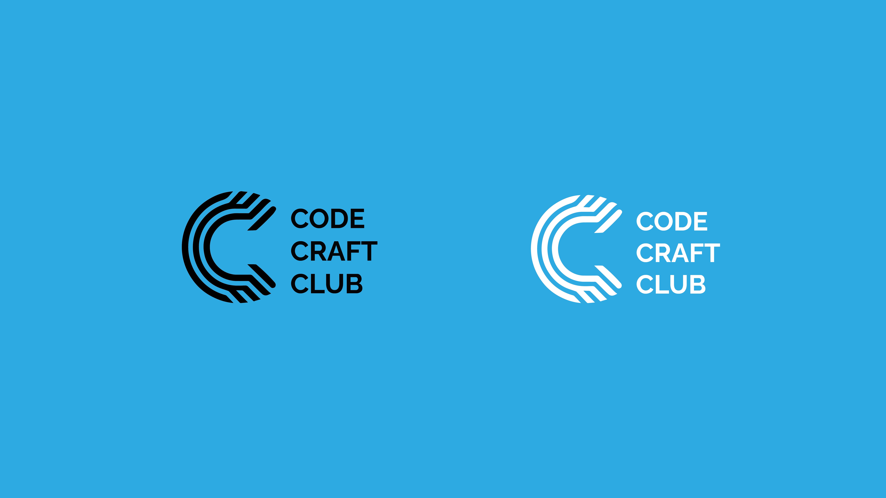

  

<h1 align="center">CodeCraftClub Cheatsheets</h1>

<i>Your ultimate, no-fluff coding companion — 30+ quick references across languages, frameworks, databases & tools.</i>

  
  
  
  
  
  

---

## ✨ What's Inside

Welcome to **CodeCraftClub-Cheatsheets** — a growing library of clear, practical, example-driven cheat sheets that simplify the concepts you reach for every day. Each sheet is built to strike the right balance between **simplicity and depth**: enough to jog your memory and get you unblocked fast, without drowning you in detail.

Whether you're prepping for exams, shipping a project, or brushing up on a new stack, these references are designed to save you time and help the core ideas click.

> **30+ cheat sheets** · Languages · Backend · Frontend · Databases · Tools — all in one place.

---

## 📚 Table of Contents

### 📃 Languages

  
View cheatsheets

  - [Python](Languages/PythonCheatsheet.md)
  - [JavaScript](Languages/JavascriptCheatsheet.md)
  - [TypeScript](Languages/TypeScriptCheatsheet.md)
  - [C](Languages/CCheatsheet.md)
  - [C++](Languages/C++Cheatsheet.md)
  - [Java](Languages/JavaCheatsheet.md)
  - [Go](Languages/GoCheatsheet.md)
  - [Ruby](Languages/RubyCheatsheet.md)
  - [Rust](Languages/RustCheatsheet.md)
  - [Kotlin](Languages/KotlinCheatsheet.md)
  - [Swift](Languages/SwiftCheatsheet.md)
  - [PHP](Languages/PHPCheatsheet.md)

### 📦 Backend

  
View cheatsheets

  - [Node.js](Backend/Node.jsCheatsheet.md)
  - [Django](Backend/DjangoCheatsheet.md)
  - [Flask](Backend/FlaskCheatsheet.md)
  - [Spring Boot](Backend/SpringBootCheatsheet.md)
  - [ASP.NET Core](Backend/ASP.NETCheatsheet.md)

### 🌐 Frontend

  
View cheatsheets

  - [HTML & CSS](Frontend/HTML-CSSCheatsheet.md)
  - [React](Frontend/ReactCheatsheet.md)
  - [Angular](Frontend/AngularCheatsheet.md)
  - [Vue.js](Frontend/VueCheatsheet.md)
  - [Svelte](Frontend/SvelteCheatsheet.md)

### 🗃️ Databases

  
View cheatsheets

  - [MySQL](Databases/MySQLCheatsheet.md)
  - [PostgreSQL](Databases/PostgreSQLCheatsheet.md)
  - [MongoDB](Databases/MongoDBCheatsheet.md)
  - [Redis](Databases/RedisCheatsheet.md)

### 🔧 Tools

  
View cheatsheets

  - [Git](Tools/GitCheatsheet.md)
  - [Bash / Linux](Tools/BashCheatsheet.md)
  - [Docker](Tools/DockerCheatsheet.md)
  - [Kubernetes](Tools/KubernetesCheatsheet.md)
  - [Terraform](Tools/TerraformCheatsheet.md)

---

## 🚀 How to Use

1. **Browse** the table of contents above and click any topic.
2. **Search** within a sheet with `Ctrl/Cmd + F` — every sheet is organized by section (syntax, control flow, functions, etc.).
3. **Copy & adapt** the snippets directly into your project.
4. **Star ⭐ the repo** so you can find it again when you need it.

---

## 🤝 Contributing

Contributions are what make the community great — and they're warmly welcomed!

1. Fork the project
2. Create a branch (`git checkout -b add/rust-async-section`)
3. Add or improve a cheat sheet (keep the example-driven style and add a back-to-README link at the bottom)
4. Commit (`git commit -m "Add async section to Rust cheatsheet"`)
5. Push and open a Pull Request

Ideas for new sheets, fixes, and clearer examples are all appreciated. Check the [issues](https://github.com/Alan7149/CodeCraftClub-Cheatsheets/issues) for things to pick up.

---

## 👩‍💻👨‍💻 Contributors

  

---

## 📄 License

Distributed under the license in the [LICENSE](LICENSE) file.

  <b>Join us</b> as we navigate the nuances, tackle the tangles, and share the splendors of scripting. 
  With these cheat sheets by your side, the world of programming is yours to conquer. <b>Happy Coding!</b> 🚀

(<a href="#readme-top">🔝 back to top</a>)

